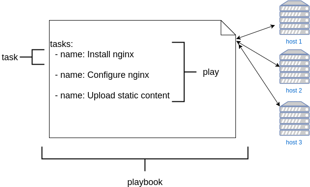
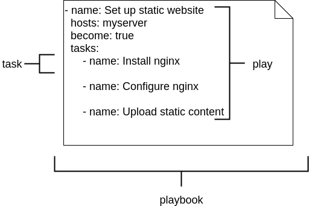
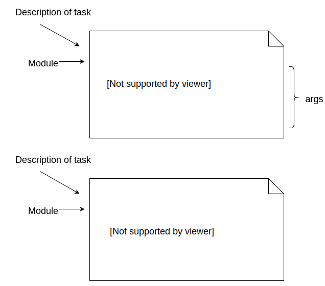

### Ansible Basics
##### (Just for review)

#### Terminology

    <dl>
        <dt>Task      </dt> <dd>   An action to perform</dd>
        <dt>Play      </dt> <dd>   a collection of tasks</dd>
        <dt>Playbook</dt>   <dd> YAML file containing one or more plays</dd>
    </dl>

 <!-- .element: class="" style="width:50%;float:left" -->

#### Ansible Playbook Structure

    

<ul>
<li class="fragment" data-fragment-index="0">
    A playbook is a YAML file containing a list of
    <em>plays</em>
</li>
<li class="fragment" data-fragment-index="1">
    A play is a dictionary object

    <ul><li>
            <code style="color:red;">key</code><code>: </code><code style="color:blue;">value</code>
        </li></ul>
</li>
<li class="fragment" data-fragment-index="2">
    Some keys in a play may contain dictionaries or
    lists
</li>
</ul>

#### Ansible Playbook Structure

                            
* A play must contain:
   * `hosts`
     * A string representing a particular host or _group_ of hosts
       * `hosts: localhost`
       * `hosts: app.mywebsite.com`
       * `hosts: appserver`
     * These are what you will configure

#### Ansible Playbook Structure

* A play may optionally contain:
   * tasks
     * A list of dictionaries
     * What you want to do
   * name
     * Description of the play
   * vars
     * Variables scoped to the play

#### Structure of a Task

* A task is a dictionary object containing
  * name 
    * Describes what the task does
    * Optional but best practice to use
  * module
    * Dictionary object
    * Key represents Python module which will perform tasks
    * May have arguments

#### Structure of a Task

    

    <ul>
        <li>
            Two styles of module object in tasks
            <ul>
                <li>string form</li>
                <li>dictionary form</li>
            </ul>
        </li>
        <li>
            Dictionary form is more suitable for complex arguments
        </li>
        <li>
            Matter of preference/style
        </li>
    </ul>

#### More Terminology
<dl>
                        <dt>Module    </dt> <dd>Blob of Python code which is executed to perform task</dd>
                        <dt>Inventory </dt> <dd>File containing hosts and groups of hosts to run tasks</dd>
                    </dl>

* [Back to outline](course-outline.md)
