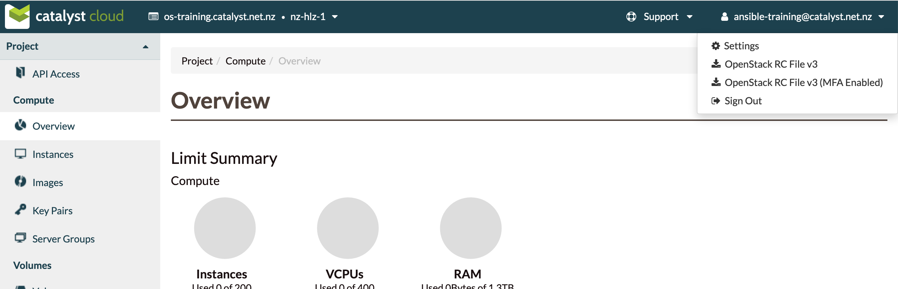

### Cloud Provider Account

#### Catalyst Cloud Registration
* Open [https://dashboard.cloud.catalyst.net.nz](https://dashboard.cloud.catalyst.net.nz)
* Sign up for an account
* Enter promo code
  - TODO: enter promo code here
  

#### Download OpenStack credentials
* In upper right corner under your account name <!-- .element: class="img-right" width="80%" -->
* Download _OpenStack RC File v3_

#### OpenStack SDK login
* Your terminal will need to be logged in to interact with OpenStack on the Catalyst
  Cloud
* Activate the OpenStack config in your terminal <!-- .element: class="fragment" data-fragment-index="0" -->
* This will prompt you to enter your Catalyst Cloud password <!-- .element: class="fragment" data-fragment-index="1" -->
    <pre><code data-trim data-noescape>
    source <mark>&lt;your account name&gt;</mark>.catalyst.net.nz-openrc.sh
    Please enter your OpenStack Password for project ...
    *******
    </code></pre>

Note: This will need to be done each time a new terminal is opened if
particpants want to connect via openstacksdk
