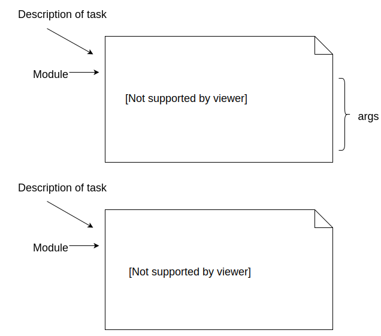
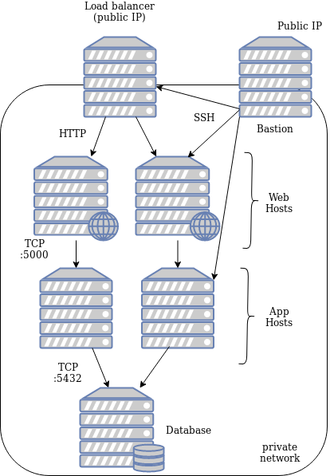
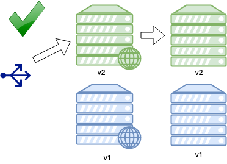

### Managing Upgrades with Ansible

# Catalyst <!-- .element class="catalyst-logo" -->

Presented by [Travis Holton](#) <!-- .element: class="small-text"  -->


## Managing Upgrades with Ansible <!-- .slide: class="title-slide" --> <!-- .element: class="orange" -->


#### Introduction


#### About me
* I work at Catalyst here in Wellington
* I write code in
  - Perl (long ago), Python
* Nowadays almost exclusively "devops" related stuff
  - mostly Ansible
  - some Docker 
  - tiny amounts of Puppet
* I also do training at Catalyst
  - Ansible
  - Kubernetes


#### Where to find me
* GitHub: [github.com/heytrav](https://github.com/heytrav)
* Twitter: [@heytrav](https://twitter.com/heytrav)
* Email: travis@catalyst.net.nz


#### About this course
* Assumes some experience with Ansible
* Assumes knowledge of basic concepts:
  - playbooks
  - plays
  - tasks
  - variables
* YAML


#### Source material
- Keating, Jesse. [*Mastering Ansible*](https://www.paktpub.com/au/networking-and-servers/mastering-ansbile). Packt, 2015
- Hochstein, Lorin et al. *Ansible Up & Running 2nd Edition*.
  O'Reilly, 2017
- [https://docs.ansible.com/ansible/latest/user_guide/playbooks_delegation.html](https://docs.ansible.com/ansible/latest/user_guide/playbooks_delegation.html)
- Based somewhat on my own experience


### Course Outline
* [Setup](#setup)
* [Cloud Signup](#cloud-provider-account)
* [Review basics](#ansible-basics)
* [Provisioning Machines](#provisioning-hosts)
* [Deploying the Application](#deploying-the-application)
* [Upgrade Strategies](#upgrade-strategies)
* [In-place rolling upgrade](#in-place-rolling-upgrade)
* [Blue Green](#blue-green-deployments)
* [closing](#the-end)


### Setup


#### Checkout the code
* Clone the course material and sample code
  ```shell
  git clone https://github.com/heytrav/ansible-workshop-2019.git
  ```
  <!-- .element: style="font-size:11pt;"  -->
* ..or follow along in pdf in base directory


#### Installing Ansible
* For this workshop we'll be using Ansible &ge; 2.8
* [Installation options](http://docs.ansible.com/ansible/latest/intro_installation.html)


###### Setup Python virtualenv
* Requirements
  - &ge; python3.5
  - virtualenv
* Set up local Python environment
   ```shell
   virtualenv -p `which python3` ~/venv
   ```
* <!-- .element: class="fragment" data-fragment-index="0" -->Activate virtualenv as base of Python interpreter
   ```shell
   source ~/venv/bin/activate
   ```


###### Install Ansible
* <!-- .element: class="fragment" data-fragment-index="0" -->Update Python package manager (pip)
   ```
   pip install -U pip
   ```
* <!-- .element: class="fragment" data-fragment-index="1" -->Use Python package manager to install Ansible
   ```
   pip install ansible
   ```


###### Install OpenStack dependencies
* Install OpenStack SDK
   ```
   pip install openstacksdk dnspython
   ```
* Install OpenStack client libraries
   ```
   pip install python-{openstackclient,ceilometerclient,heatclient,neutronclient,swiftclient,octaviaclient,magnumclient}
   ```
   <!-- .element: style="font-size:8pt;"  -->


#### Decrypting vault secrets
* Some variables are stored using `ansible-vault`
* We can avoid having ansible complain about not finding a vault password
* The `ansible.cfg` file is set up to look for a file called `.default_id`
  ```ini
  vault_identity_list = default@.default_id
  ```
* Create an identity file to store the password
  ```
  echo "train" > .default_id
  ```


### Cloud Provider Account


#### Catalyst Cloud Registration
* Open [https://dashboard.cloud.catalyst.net.nz](https://dashboard.cloud.catalyst.net.nz)
* Sign up for an account
* Enter promo code
  - TODO: enter promo code here
  


#### Download OpenStack credentials
* In upper right corner under your account name <!-- .element: class="img-right" width="80%" -->
* Download _OpenStack RC File v3_


#### OpenStack SDK login
* Your terminal will need to be logged in to interact with OpenStack on the Catalyst
  Cloud
* Activate the OpenStack config in your terminal <!-- .element: class="fragment" data-fragment-index="0" -->
* This will prompt you to enter your Catalyst Cloud password <!-- .element: class="fragment" data-fragment-index="1" -->
    <pre><code data-trim data-noescape>
    source <mark>&lt;your account name&gt;</mark>.catalyst.net.nz-openrc.sh
    Please enter your OpenStack Password for project ...
    *******
    </code></pre>

Note: This will need to be done each time a new terminal is opened if
particpants want to connect via openstacksdk


### Ansible Basics
##### (Just for review)


#### Terminology
<div style="width:50%;float:left;">
    <dl>
        <dt>Task      </dt> <dd>   An action to perform</dd>
        <dt>Play      </dt> <dd>   a collection of tasks</dd>
        <dt>Playbook</dt>   <dd> YAML file containing one or more plays</dd>
    </dl>
</div>
 <!-- .element: class="" style="width:50%;float:left" -->


#### Ansible Playbook Structure
 <!-- .element: style="float:left" width="50%"-->

* A playbook is a YAML file containing a list of plays
* A play is a dictionary object


#### Ansible Playbook Structure
* A play must contain:
  * `hosts`
    * A string representing a particular host or _group_ of hosts
      * `hosts: localhost`
      * `hosts: app.mywebsite.com`
      * `hosts: appserver`
    * These are what you will configure


#### Ansible Playbook Structure

* A play may optionally contain:
   * tasks
     * A list of dictionaries
     * What you want to do
   * name
     * Description of the play
   * vars
     * Variables scoped to the play


#### Structure of a Task

* A task is a dictionary object containing
  * name 
    * Describes what the task does
    * Optional but best practice to use
  * module
    * Dictionary object
    * Key represents Python module which will perform tasks
    * May have arguments


#### Structure of a Task
<div style="width:50%;float:left;">
    
</div>
<div style="width:50%;float:left;">
    <ul>
        <li>
            Two styles of module object in tasks
            <ul>
                <li>string form</li>
                <li>dictionary form</li>
            </ul>
        </li>
        <li>
            Dictionary form is more suitable for complex arguments
        </li>
        <li>
            Matter of preference/style
        </li>
    </ul>
</div>


#### More Terminology
<dl>
                        <dt>Module    </dt> <dd>Blob of Python code which is executed to perform task</dd>
                        <dt>Inventory </dt> <dd>File containing hosts and groups of hosts to run tasks</dd>
                    </dl>


#### Indentation & YAML
* <!-- .element: class="fragment" data-fragment-index="0" -->YAML is a stickler for indentation
* <!-- .element: class="fragment" data-fragment-index="1" -->TABS not allowed (Ansible will complain)
* <!-- .element: class="fragment" data-fragment-index="2" -->Playbook indentation
  <pre style="font-size:10pt;"><code data-trim data-noescape>
  - name: This is a play
  <mark>  </mark>hosts: somehosts             # 2 spaces
  <mark>  </mark>tasks:
  <mark style="background-color:lightblue">    </mark>- name: This is a task     # 4 spaces
  <mark style="background-color:lightgreen">      </mark>module:                  # 6 spaces
  <mark style="background-color:pink">        </mark>attr: someattr         # 8 spaces
  <mark style="background-color:pink">        </mark>attr1: someattr
  <mark style="background-color:pink">        </mark>attr2: someattr
</code></pre>
* <!-- .element: class="fragment" data-fragment-index="3" -->Use an editor that supports YAML syntax
  - Atom
  - Vim
  - Emacs


#### Vim YAML setup
* `.vimrc` file
  ```
  syntax on
  filetype plugin indent on
  ```
* `~/.vim/after/ftplugin/yaml.vim`
  ```
  set tabstop=2 "Indentation levels every two columns
  set expandtab "Convert all tabs that are typed to spaces
  set shiftwidth=2 "Indent/outdent by two columns
  set shiftround "Indent/outdent to nearest tabstop
  ```
  <!-- .element: style="font-size:11pt;"  -->


### Provisioning Hosts


#### Creating Our Cluster
* For this tutorial we are going to need seven machines
  - 2 for nginx web server
  - 2 for our web application
  - 1 database host
  - 1 load balancer
  - 1 bastion
* Seems like a lot, but we are trying to simulate upgrades across a cluster


#### Our cluster 
* <!-- .element: class="fragment" data-fragment-index="0" -->HTTP traffic reaches web hosts via load balancer
 <!-- .element: class="img-right"  width="30%"  -->
* <!-- .element: class="fragment" data-fragment-index="1" -->Application receives traffic from web hosts on port 5000
* <!-- .element: class="fragment" data-fragment-index="2" -->DB receives traffic from app hosts on 5432
* <!-- .element: class="fragment" data-fragment-index="3" -->SSH traffic
  - only bastion reachable from outside
  - all other hosts only from bastion


#### Host Inventory
* The inventory for our cluster is defined in 
  ```shell
  ansible/inventory/cloud-hosts
  ```
* Architecture defined using Ansible _groups_
  ```ini
  [loadbalancer]
  pycon-lb

  [web]
  pycon-web[1:2]# range of hosts i.e. pycon-web1, pycon-web2

  [app]
  pycon-app[1:2] 
  ```
  <!-- .element: style="font-size:9pt;"  -->
* Hosts may belong to multiple groups
  ```ini
  [web]
  pycon-web[1:2]

  [blue]
  pycon-web1
  ```
  <!-- .element: style="font-size:9pt;"  -->


#### High Level View <!-- .slide: class="image-slide" -->


#### The `provision-hosts.yml` playbook
* <!-- .element: class="fragment" data-fragment-index="0" -->Tasks in the
  first play are executed on local machine
   <pre style="font-size:10pt;"><code data-trim data-noescape>
   name:  Provision a set of hosts in Catalyst Cloud
   hosts: <mark>localhost</mark>
   gather_facts: false
   tasks:
</code></pre>
* <!-- .element: class="fragment" data-fragment-index="1" -->Behind the scenes using the `openstacksdk` API
* <!-- .element: class="fragment" data-fragment-index="2" -->Boilerplate for creating multiple cloud hosts
  - log in to cloud provider
  - create router, network, security groups
  - create each host

Note:
- all tasks with os in module are cloud api
- building cloud modules generally boilerplate


#### Cloud Modules
* Cloud deployments typically involve creating resources with a provider
  - Instances
  - Networks
  - Security groups, acls, etc
* We are using [OpenStack Modules](https://docs.ansible.com/ansible/latest/modules/list_of_cloud_modules.html#openstack)
  - All start with `os_`


#### Using OpenStack cloud modules
* The first play uses cloud modules to create objects on your tenant

```yaml
- name: Provision a set of hosts in the Catalyst Cloud
  hosts: localhost
  gather_facts: false
  tasks:
    - name: Connect to Catalyst Cloud
      os_auth:
      
    - name: Create keypair
      os_keypair:

    - name: Create network
      os_network:

    - name: Create cluster instances
      os_server:
```
<!-- .element: style="font-size:11pt;"  -->


#### Using Ansible via a bastion host
* Hosts in *private_net* group do not have public IP  <!-- .element: class="img-right" width="60%" -->
* Only bastion is directly accessible by SSH <!-- .element: class="fragment" data-fragment-index="0" -->
* All other hosts can only be reached from<!-- .element: class="fragment" data-fragment-index="2" --> _bastion_ 

Note: Adds some extra security for our cluster 


#### Traversing a bastion host
* <!-- .element: class="fragment" data-fragment-index="0" -->Ansible relies on SSH to talk to remote hosts
* <!-- .element: class="fragment" data-fragment-index="1" -->Just need to pass SSH arguments for hosts in *private_net* group
* <!-- .element: class="fragment" data-fragment-index="2" -->Use `add_host` to
  assign `ansible_ssh_common_args`

```
# ADD SSH args
 - name: Set ssh args for bastion
   add_host:
     name: "{{ item.openstack.name  }}"
     ansible_ssh_common_args: "-o StrictHostKeyChecking=no -o ForwardAgent=yes"
   loop: "{{ launch.results }}"
   when: item.openstack.name in groups.bastion

 - name: Set ssh args for rest of cluster
   add_host:
     name: "{{ item.openstack.name  }}"
     ansible_ssh_common_args: "-o StrictHostKeyChecking=no -o ForwardAgent=yes -o ProxyCommand='ssh {{ hostvars[item.openstack.name].ansible_user }}@{{ hostvars[groups.bastion[0]].ansible_host }} exec nc -w300 %h %p'"
   loop: "{{ launch.results }}"
   when: item.openstack.name in groups.private_net
```
<!-- .element: style="font-size:7pt;"  class="fragment"
data-fragment-index="3" -->


#### Additional setup for hosts
* Edit `/etc/hosts` on each host
  * bastion host to resolve all hosts in cluster for SSH
  * _web_ to resolve _app_ host
  * _app_ host to resolve _db_
* Set NZ locale, timezone, etc.


#### Resolving for SSH
* Add following to playbook

```yaml
# ADD bastion -> private_net for SSH
- name: Set up the bastion host mapping
  hosts: bastion
  become: true
  tasks:
    - name: Add entry to /etc/hosts for all instances
      lineinfile:
        dest: /etc/hosts
        line: "{{ hostvars[item].ansible_host }} {{ item }}"
      with_items: "{{ groups.private_net }}"
```
<!-- .element: style="font-size:10pt;"  -->


#### Resolving application services
* Set up resolution for application components (i.e. nginx and application)

```
# ADD web -> app for proxy pass
- name: Set up web hosts with mapping to backend
  hosts: web
  become: true
  tasks:

    - name: Map each frontend host to speak to a specific backend
      lineinfile:
        dest: /etc/hosts
        line: "{{ hostvars[groups.app[(group_index | int) - 1]].ansible_host }} backend"

# ADD app -> db for application
- name: Add mapping for db on app boxes
  hosts: app
  become: true
  tasks:

    - name: Map each app host to speak to db
      lineinfile:
        dest: /etc/hosts
        line: "{{ hostvars[item].ansible_host }} {{ item }}"
      with_items: "{{ groups.db }}"
```
<!-- .element: style="font-size:8pt;"  -->


#### Set up locale and timezone
```
# ADD locale and timezone
- name: Set locale and local timezone
  hosts: cluster
  become: true
  tasks:

    - name: Add NZ locale to all instances
      locale_gen:
        name: en_NZ.UTF-8
        state: present

    - name: Set local timezone
      timezone:
        name: Pacific/Auckland
```
<!-- .element: style="font-size:10pt;"  -->


#### Provisioning Hosts
*  Start the provisioning playbook
   ```
   ansible-playbook -i ansible/inventory/cloud-hosts ansible/provision-hosts.yml
   ```
   <!-- .element: style="font-size:11pt;" class="stretch"  -->

* Should take a few minutes to set up cluster
* In case task fails with SSH error just hit `CTRL-C` and restart
<!-- .element: class="stretch"  -->


#### `ansible-inventory`
* Useful to gather info about hosts
  - public IP
  - groups
* Can use `ansible-inventory` to gather info about cluster
  ```shell
  ansible-inventory --list
  ```
  ```shell
  ansible-inventory --host pycon-bastion
  ```
* Pipe output through tools like [`jq`](https://stedolan.github.io/jq/)


#### Get bastion IP
* We'll need the bastion IP if we want to SSH into hosts in the cluster
  ```shell
  ansible-inventory --host pycon-bastion | jq '{"publicIP": .openstack.public_v4}'
  ```
  <!-- .element: style="font-size:12pt;"  -->
  ```json
  {
    "publicIP": "202.49.242.143"
  }
  ```
* Use this to SSH into cluster
  ```shell
  ssh -A -t ubuntu@202.49.242.143 ssh pycon-web1
  ```


### Deploying the application


#### Deploying our application
* The `deploy.yml` playbook sets up the _Cat Pic of the Day_ application  <!-- .element: class="img-right" width="50%"-->
  * Web server running nginx
  * App server running a Python Flask
  * Postgresql Database
  * HA proxy


#### Overview of deploy playbook
* `ansible-playbook --list-tasks <playbook>` gives an overview of plays and
  tasks 
  ```
  ansible-playbook ansible/deploy.yml --list-tasks
  ```
  ```
  play #1 (private_net): Set ansible_host for private hosts     TAGS: []                                                                                  [0/19740]
    tasks:
    .
  play #2 (cluster): Update apt cache on all machines   TAGS: []
    tasks:
    .

  play #3 (db): Set up database machine TAGS: [deploy,db]
    tasks:
    .

  play #4 (db): Set up app and database machine TAGS: [deploy,db]
    tasks:
    .

  play #5 (app): Set up app server      TAGS: [deploy,app]
    tasks:
    .

  play #6 (web): Set up nginx on web server     TAGS: [deploy,web]
    tasks:
    .
  ```
  <!-- .element: style="font-size:8pt;"  -->


#### Role of Inventory and Groups
* _hosts_ attribute influences which hosts Ansible interacts with
  <pre><code data-trim data-noescape>
  hosts: <mark>web</mark>
  </code></pre>
* This will interact with all hosts in the _web_ group  <!-- .element: class="img-right" width="45%" -->


#### Role of Inventory and Groups
  <pre><code data-trim data-noescape>
  hosts: <mark>app</mark>
  </code></pre>
* This will interact with all hosts in the _app_ group  <!-- .element: class="img-right" width="45%" -->


#### Deploying the application
* Run the deploy playbook
  ```shell
  ansible-playbook ansible/deploy.yml
  ```
* Once deploy is finished you'll need the IP of your loadbalancer
  ```
  ansible-inventory --host pycon-lb | jq '{"publicIP": .openstack.public_v4}'
  ```
  <!-- .element: style="font-size:10pt;"  -->
* Should be able to open in your browser as:
  ```
  http://<public ip>.xip.io/
  ```


#### Viewing HAProxy stats
* HAProxy provides an overview of active web hosts in cluster
  ```
  http://<public ip>.xip.io/haproxy?stats
  ```
* Login details
  - user: admin
  - password: train


### Upgrade strategies


####  What can go wrong?
* Without some kind of redundancy, we risk of disrupting entire operation <!-- .element: class="fragment" data-fragment-index="0" -->

<div  class="fragment" data-fragment-index="0">


<!-- .element width="50%" height="50%"-->
</div>


#### Ideal upgrade scenario
* Minimal or zero downtime during upgrade of application
* Do not deploy a broken version of our application


#### Upgrade Strategies
* In-place rolling upgrade
* Blue-Green


#### In-place rolling upgrade

* Traditional approach to upgrading applications across a cluster <!-- .element: class="fragment" data-fragment-index="0" -->
  - Creating new infrastructure can be prohibitively expensive
* Operates on infrastructure that already exists <!-- .element: class="fragment" data-fragment-index="1" -->
* Minimise downtime by upgrading parts of the cluster at a time <!-- .element: class="fragment" data-fragment-index="2" -->


#### Upgrading applications
* Rolling upgrade play similar to running just _app_ plays in `deploy.yml`
  ```shell
  ansible-playbook  ansible/app-rolling-upgrade.yml -e app_version=v2
  ```
  <!-- .element: style="font-size:10pt;"  -->
  ```
  ansible-playbook ansible/deploy.yml -e app_version=v2 --limit app
  ```
  <!-- .element: style="font-size:10pt;"  -->
* Tempting to rely on Ansible's idempotent behaviour
* There are two problems with this approach
  - Ansible's default _batch management_ behaviour
  - `deploy.yml` does not check _health_ of application


#### Ansible _batch management_ problem
* By default runs each task on all hosts concurrently
* <!-- .element: class="fragment" data-fragment-index="4" -->A failed task might leave cluster in a broken state

|Tasks | Host1 | Host2 |
|---   | ---   | ---   |
|task1 |  <code style="color:green;" class="fragment" data-fragment-index="0">ok</code>     |   <code style="color:green;" class="fragment" data-fragment-index="0">ok</code>    | 
|task2 |  <code style="color:green;" class="fragment" data-fragment-index="1">ok</code>     |    <code style="color:green;" class="fragment" data-fragment-index="1">ok</code>   |
|task3 |   <code style="color:red;" class="fragment" data-fragment-index="2">fail</code>    |   <code style="color:red;" class="fragment" data-fragment-index="2">fail</code>    | 
|task4  |    <code class="fragment" data-fragment-index="3">-</code>   |   <code class="fragment" data-fragment-index="3">-</code>    |  


#### Deploying broken code
* Broken code may not be obvious in task
* <!-- .element: class="fragment" data-fragment-index="2" -->One task (<code style="color:red;">\*</code>) leaves application in a broken state

|Tasks | Host1 | Host2 |
|---   | ---   | ---   |
|task1 |  <code style="color:green;" class="fragment" data-fragment-index="0">ok</code>     |   <code style="color:green;" class="fragment" data-fragment-index="0">ok</code>    |
|task2 |  <code style="color:green;" class="fragment" data-fragment-index="1">ok</code>     |    <code style="color:green;" class="fragment" data-fragment-index="1">ok</code>   |
|task3<code style="color:red;" class="fragment" data-fragment-index="2">\*</code>  |   <code style="color:green;" class="fragment" data-fragment-index="2">ok</code>    |   <code style="color:green;" class="fragment" data-fragment-index="2">ok</code>    | 
|task4 |   <code style="color:green;" class="fragment" data-fragment-index="3">ok</code>    |   <code style="color:green;" class="fragment" data-fragment-index="3">ok</code>    | 

<!-- .element: style="float:left" width:50%  -->

 <!-- .element: class="fragment" width="50%" data-fragment-index="4"  -->


#### Fixing the batch problem
* The `serial` attribute can be added to the _play_ attributes
* Determines batch size Ansible will operate in parallel
  - integer
    * <code>serial: 1</code>
    * <code>serial: 3</code>
  - percentage of cluster
    * <code>serial: 50%</code>


#### Controlled batch size
* Running with `serial` attribute set to 1

|Tasks | Host1 | Host2 |
|---   | ---   | ---   |
|task1 |  <code style="color:green;" class="fragment" data-fragment-index="0">ok</code>     |   <code style="color:green;" class="fragment" data-fragment-index="4">ok</code>    |
|task2 |  <code style="color:green;" class="fragment" data-fragment-index="1">ok</code>     |    <code style="color:green;" class="fragment" data-fragment-index="5">ok</code>   | 
|task3  |   <code style="color:green;" class="fragment" data-fragment-index="2">ok</code>    |   <code style="color:green;" class="fragment" data-fragment-index="6">ok</code>    | 
|task4 |   <code style="color:green;" class="fragment" data-fragment-index="3">ok</code>    |   <code style="color:green;" class="fragment" data-fragment-index="7">ok</code>    | 


#### Using `serial` in our upgrade
* Update `app-rolling-upgrade.yml` as follows:
  <pre style="font-size:10pt;"><code data-trim data-noescape class="yaml">
  - name: Upgrade application in place
    become: true
    hosts: app
    # Serial attribute
    <mark>serial: 1</mark>
  </code></pre>
* Run the `app-rolling-upgrade.yml` playbook again with `-e app_version=v2`
* <!-- .element: class="fragment" data-fragment-index="0" -->Try again with `-e app_version=v3`


#### Deploying broken code
* Deploying `app_version=v3` still breaks the application

|Tasks | Host1 | Host2 |
|---   | ---   | ---   |
|task1 |  <code style="color:green;" class="fragment" data-fragment-index="0">ok</code>     |   <code style="color:green;" class="fragment" data-fragment-index="4">ok</code>    | 
|task2 |  <code style="color:green;" class="fragment" data-fragment-index="1">ok</code>     |    <code style="color:green;" class="fragment" data-fragment-index="5">ok</code>   |
|task3<code style="color:red;" class="fragment" data-fragment-index="2">\*</code>  |   <code style="color:green;" class="fragment" data-fragment-index="2">ok</code>    |   <code style="color:green;" class="fragment" data-fragment-index="6">ok</code>    | 
|task4 |   <code style="color:green;" class="fragment" data-fragment-index="3">ok</code>    |   <code style="color:green;" class="fragment" data-fragment-index="7">ok</code>    | 


#### Detecting Failure
* Need to detect broken application and stop deployment
* Verify app is running after upgrade
  - process id
  - listening on port
* The Flask web application that runs on app server listens on port 5000
* Can use `wait_for` to stop and listen for port to be open before proceeding


#### Listen on port
* Add following to `app-rolling-upgrade.yml`
  ```
  # ADD wait for 5000
  - name: Make sure gunicorn is accepting connections
    wait_for:
      port: 5000
      timeout: 60
  ```
* We're still missing something so don't run the playbook yet!


#### Kicking the handlers
* The application may not have loaded new configuration
* We need to cause handler to restart gunicorn before waiting on port
* Add following to `app-rolling-upgrade.yml`
  ```
  # ADD flush handlers
  - meta: flush_handlers
  ```
* Now re-run the playbook with `-e app_version=v3`


#### Failing fast
* Playbook stops execution on first host when check on port fails

|Tasks | Host1 | Host2 |
|---   | ---   | ---   |
|task1 |  <code style="color:green;" class="fragment" data-fragment-index="0">ok</code>     |   <code class="fragment" data-fragment-index="4">-</code>    | 
|task2 |  <code style="color:green;" class="fragment" data-fragment-index="1">ok</code>     |    <code class="fragment" data-fragment-index="4">-</code>   |
|restart gunicorn<code style="color:red;" class="fragment" data-fragment-index="2">\*</code>  |   <code style="color:green;" class="fragment" data-fragment-index="2">ok</code>    |   <code class="fragment" data-fragment-index="4">-</code>    | 
|wait_for |   <code style="color:red;" class="fragment" data-fragment-index="3">fail</code>    |   <code style="color:green;" class="fragment" data-fragment-index="4">-</code>    | 


#### Load balancing and upgrades
* During an upgrade we change configuration and restart the application
* Downtime might be disruptive to users of website
* Following update with `app_version=v3` half of the application is also
  broken
  ```
  curl --head http://<public ip>.xip.io
  ```
  ```
  < HTTP/1.1 502 Bad Gateway
  HTTP/1.1 502 Bad Gateway
  .
  ```


#### Avoiding disruptions 
* Ideally the loadbalancer should not send traffic to the hosts(s) we are
  updating
* While upgrading _app_ host, need to disable traffic to upstream web host


#### Host Context
* <!-- .element: class="fragment" data-fragment-index="0" -->The `hosts:` attribute of a play determines *context*
  <pre><code data-trim data-noescape> 
  - name: Play on app host
    <mark>hosts: app</mark>
  </code></pre>
* <!-- .element: class="fragment" data-fragment-index="1" -->While on host `app1`, I can call all inventory variables by name, i.e.
  - `ansible_host`
* <!-- .element: class="fragment" data-fragment-index="2" -->If I want variable for a different host, must use _hostvars_
  - hostvars['otherhost'].ansible_host


#### Delegation
* <!-- .element: class="fragment" data-fragment-index="0" -->Sometimes need to configure one host *in the context of another host*
* <!-- .element: class="fragment" data-fragment-index="1" -->Run a command on server **B** using inventory from **A**
  * enable/disable web hosts at the load balancer
* <!-- .element: class="fragment" data-fragment-index="2" -->The `delegate_to` directive is useful for this


#### Using delegation
* We want to disable host we're updating on pycon-lb
  <pre class="fragment" data-fragment-index="0"><code data-trim data-noescape>
    # ADD disable application at lb
    - name: Disable application at load balancer
      haproxy:
        backend: catapp-backend
        host: "{{ web_server }}"
        state: disabled
      <mark>delegate_to: "{{ item }}"</mark>
      <mark>loop: "{{ groups.loadbalancer }}"</mark>
  </code></pre>


#### Enabling host at loadbalancer
* When we are sure the app is running, we need to re-enable traffic to the
  host
  <pre class="fragment" data-fragment-index="0"><code data-trim data-noescape>
    # ADD enable application at lb
    - name: Re-enable application at load balancer
      haproxy:
        backend: catapp-backend
        host: "{{ web_server }}"
        state: enabled
      <mark>delegate_to: "{{ item }}"</mark>
      <mark>loop: "{{ groups.loadbalancer }}"</mark>
  </code></pre>


#### In Place Rolling Upgrade
* Run playbook with `app_version=`
  - v1
  - v2
  - v3
* During upgrades 
  - curl site url from terminal
  - check HAProxy stats
* Upgrade  to v3 should not leave entire cluster (or part of site) broken


#### First step of in place upgrade

 <!-- .element
width="50%" height="50%"-->

* Disable application at LB (no HTTP requests) <!-- .element: class="fragment" data-fragment-index="0" -->
* Upgrade necessary applications, configuration <!-- .element: class="fragment" data-fragment-index="1" -->
* Re-enable at LB <!-- .element: class="fragment" data-fragment-index="2" -->


#### In place rolling upgrade
 <!-- .element width="50%" height="50%"-->

* Repeat process across pool <!-- .element: class="fragment" data-fragment-index="0" -->
* Mixed versions will be running for a period of time <!-- .element: class="fragment" data-fragment-index="1" -->


#### Blue Green Deployments


Start with all traffic going to _blue_ hosts


#### Begin update


Update traffic on _green_ hosts


#### Check green is ok


Direct traffic through green and verify ok


#### Update blue side of cluster


Ok, so update _blue_ side


#### Reset traffic to blue


Reset traffic to _blue_ side of cluster


#### Dealing with failure


Alternative if green app not healthy


#### Return to original state


Redirect traffic back to _blue_


#### Setting up Blue-Green
* We need to do is put our cluster in _blue-green_ mode
* <!-- .element: class="fragment" data-fragment-index="0" -->First reset our environment
  ```
   ansible-playbook ansible/app-rolling-upgrade.yml -e app_version=v1
  ```
* <!-- .element: class="fragment" data-fragment-index="1" -->Run the following playbook:
  ```
  ansible-playbook ansible/setup-blue-green.yml -e live=blue
  ```
* <!-- .element: class="fragment" data-fragment-index="2" -->Verify half of cluster active on HAProxy stats page


#### Blue green update playbook
* For blue green we will use the following playbook
  ```
  ansible/app-blue-green-upgrade.yml
  ```


#### Ad hoc groups
* For _blue-green_ we need to assign _active_ and _not active_ half of cluster
* <!-- .element: class="fragment" data-fragment-index="0" -->Can assign groups of hosts to _ad hoc_ groups 
* <!-- .element: class="fragment" data-fragment-index="1" -->By default we declare _blue_ active
* <!-- .element: class="fragment" data-fragment-index="2" -->Add following to `app-blue-green-upgrade.yml`
   <pre style="font-size:10pt;" ><code data-trim data-noescape>
   # ADD set active group
  - name: Set live group as active
    hosts: localhost
    gather_facts: false
    vars:
      active: "{{ groups[ live | default('blue') ] }}"
    tasks:
      - name: Add active hosts to group
        add_host:
          name: "{{ item }}"
          groups:
        <mark>    - active</mark>
        with_items: "{{ active | default(groups.blue_green) }}"
</code></pre>


#### Operating on groups and subgroups
* The play we added creates an  _ad hoc_ group called **active**
* <!-- .element: class="fragment" data-fragment-index="0" -->Initially equal to **blue** group
   <!-- .element: class="img-right" -->
* <!-- .element: class="fragment" data-fragment-index="1" -->We want to update hosts **not in the active**


### Group set theory


#### Ansible set theory operators
* The _hosts_ attribute has syntax for set theory operations on inventory 
* These enable fine control over which hosts playbooks operate


#### Union
##### A ∪ B

Combination of hosts in two groups

 <!-- .element: width="20%" height="20%" -->

All hosts in<!-- .element: class="fragment" data-fragment-index="0" --> _web_ and _db_ groups 

<pre  class="fragment" data-fragment-index="0"><code data-trim data-noescape>
- name: Union of hosts
  <mark>hosts: web:db</mark>
  tasks:
</code></pre>


#### Intersection
##### A ∩ B

Hosts that are in first and second group

 <!-- .element: width="20%"
height="20%" -->

Hosts that are in both the<!-- .element: class="fragment" data-fragment-index="0" --> _web_ and the _blue_ group 

<pre  class="fragment" data-fragment-index="0"><code data-trim data-noescape>
- name: Intersection of hosts
  <mark>hosts: web:&blue</mark>
  tasks:
</code></pre>


#### Difference
##### A \ B

Set of hosts in first set but not in second set

<!-- .element: width="20%"
height="20%" -->

Hosts that are in the<!-- .element: class="fragment" data-fragment-index="0" --> _app_ group **but not** in the _active_ group

<pre  class="fragment" data-fragment-index="0"><code data-trim data-noescape>
- name: Difference of groups
  <mark>hosts: app:!active</mark>
  tasks:
</code></pre>


#### Set operators and upgrade
* Update playbook similar to rolling upgrade example
* <!-- .element: class="fragment" data-fragment-index="0" -->Update app in inactive part of cluster
  ```
  # ADD set to update
  hosts: app:!active
  ```
* <!-- .element: class="fragment" data-fragment-index="1" -->Should update app2  <!-- .element: class="img-right" width="50%"-->


#### Verify app is running
*  Restart the app and verify it is listening on port
   ```
   # ADD flush handlers and check port
   - meta: flush_handlers

   - name: Make sure gunicorn is accepting connections
     wait_for:
       port: 5000
       timeout: 60
   ```


#### Enabling traffic to green
* Use delegation to enable traffic to green at loadbalancer
  ```
  # ADD enable traffic to inactive
  - name: Enable traffic to updated app server
    hosts: web:!active
    become: true
    tasks:
      - name: Enable application at load balancer
        haproxy:
          backend: catapp-backend
          host: "{{ inventory_hostname }}"
          state: enabled
        delegate_to: "{{ item }}"
        loop: "{{ groups.loadbalancer }}"
  ```


#### Stop traffic to blue
* Now disable blue side at loadbalancer
  ```
  # ADD disable traffic to active side
  - name: Stop traffic to initial live group
    hosts: web:&active
    become: true
    tasks:
      - name: Disable application at load balancer
        haproxy:
          backend: catapp-backend
          host: "{{ inventory_hostname }}"
          state: disabled
        delegate_to: "{{ item }}"
        loop: "{{ groups.loadbalancer }}"
  ```


#### Run blue green upgrade
* Let's run the blue green upgrade playbook
  ```
  ansible-playbook ansible/app-blue-green-upgrade.yml -e app_version=v2
  ```
* Can switch back to blue active by running 
  ```
  ansible-playbook ansible/setup-blue-green.yml -e live=blue
  ``
* Try running upgrade with v3 and v4


#### Additional check
* <!-- .element: class="fragment" data-fragment-index="0" -->May want to make additional checks on site
* <!-- .element: class="fragment" data-fragment-index="1" -->v4 works but does not display version on site
* <!-- .element: class="fragment" data-fragment-index="2" -->Add additional check to play
  ```
  # ADD check version display
  - name: Check that the site is reachable via nginx
    uri:
      url: "http://{{ ansible_host }}:5000"
      status_code: 200
      return_content: yes
      headers:
        HOST: my-app.cats
    register: app_site
    failed_when: "'version: ' + app_version not in app_site.content"
    delegate_to: "{{ web_server }}"
  ```


### The End
* Please clean up your clusters
  ```
  ansible-playbook ansible/remove-hosts.yml
  ```
