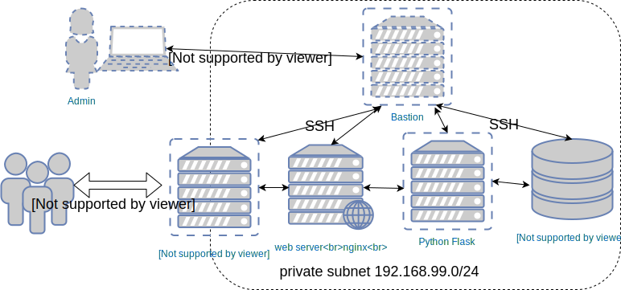
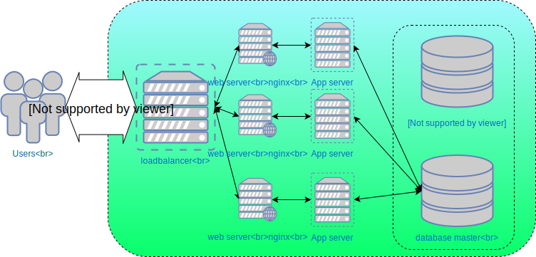

## Deploying applications


#### Deploying applications

<pre  class="fragment" data-fragment-index="0"><code data-trim data-noescape>
cd $INTERMED_ANSIBLE_DIR/deploying-code
tree
.
├── <mark>provision-hosts.yml</mark>
├── <mark>deploy.yml</mark>
templates
└── index.html
wsgi.py
</code></pre>

* This lesson sets up the<!-- .element: class="fragment" data-fragment-index="1" --> _Cat Pic of the Day_ application 
* We'll be using this demonstrate deploying and later upgrading applications
  <!-- .element: class="fragment" data-fragment-index="2" -->


#### Basic application


* Web server running nginx
* App server running a Python Flask web application
* A database
* All behind a loadbalancer


#### Provisioning machines

* The<!-- .element: class="fragment" data-fragment-index="0" --> `provision-hosts.yml` playbook contains several plays 
  * Preflight plays to set up variables <!-- .element: class="fragment" data-fragment-index="1" -->
  * Provision openstack instances <!-- .element: class="fragment" data-fragment-index="3" -->
    - Create network infrastructure <!-- .element: class="fragment" data-fragment-index="4" -->
    - Create servers <!-- .element: class="fragment" data-fragment-index="5" -->
    - Set up necessary security groups <!-- .element: class="fragment" data-fragment-index="6" -->
  * Basic setup for machines <!-- .element: class="fragment" data-fragment-index="7" -->


#### Provisioning

* When interacting with cloud providers Ansible modules leverage APIs <!-- .element: class="fragment" data-fragment-index="0" -->
  - [AWS](https://docs.ansible.com/ansible/latest/list_of_cloud_modules.html#amazon)
  - [Azure](https://docs.ansible.com/ansible/latest/list_of_cloud_modules.html#azure)
  - [OpenStack](https://docs.ansible.com/ansible/latest/list_of_cloud_modules.html#openstack)
* Actions performed from<!-- .element: class="fragment" data-fragment-index="1" --> _localhost_ 
* In general Ansible will need to <!-- .element: class="fragment" data-fragment-index="2" -->
  - Authenticate with cloud provider <!-- .element: class="fragment" data-fragment-index="3" -->
  - Create network devices <!-- .element: class="fragment" data-fragment-index="4" -->
  - Create machines <!-- .element: class="fragment" data-fragment-index="5" -->


#### Preparing your local machine

* Provisioned machines are configured just enough that you
  (and Ansible) can log in via SSH <!-- .element: class="fragment" data-fragment-index="0" -->
* A few<!-- .element: class="fragment" data-fragment-index="1" --> _blockinfile_ tasks in provisioning will make SSH interaction easier 
  - Configure<!-- .element: class="fragment" data-fragment-index="2" --> `~/.ssh/config` 
    * hostname from inventory
    * ssh key checking turned **off**
  - Add entries to<!-- .element: class="fragment" data-fragment-index="3" --> `/etc/hosts`  


#### Setting up new hosts

* The next thing we need to do is set up remote machines <!-- .element: class="fragment" data-fragment-index="0" -->
* Need to <!-- .element: class="fragment" data-fragment-index="1" -->
  - Set the locale to NZ <!-- .element: class="fragment" data-fragment-index="2" -->
  - Add entries for other hosts in private network <!-- .element: class="fragment" data-fragment-index="3" -->
* We have a special setup w.r.t. SSH in our cluster <!-- .element: class="fragment" data-fragment-index="4" -->


#### Bastion host

 
* Only one machine is directly accessible by SSH <!-- .element: class="fragment" data-fragment-index="0" -->
* This host is a<!-- .element: class="fragment" data-fragment-index="1" --> _bastion_ or _jump host_ 
* All other hosts can only be reached from<!-- .element: class="fragment" data-fragment-index="2" -->
 _bastion_ Note: Adds some extra security for our cluster 


#### Using Ansible via a bastion host

* Ansible allows us to pass options to SSH for all interactions with a host <!-- .element: class="fragment" data-fragment-index="0" -->
  ```yaml
  ansible_ssh_common_args: >  
      -o StrictHostKeyChecking=no  
      -o ProxyCommand='ssh train@train-pc exec nc -w300 %h %p'"
  ```
* This tells Ansible to<!-- .element: class="fragment" data-fragment-index="1" --> _transparently_ proxy all SSH connections through our bastion 
* This has also been setup in your<!-- .element: class="fragment" data-fragment-index="2" --> `~/.ssh/config` 
  ```yaml
  ProxyCommand ssh train@train-pc exec nc -w300 %h %p
  ```


#### Delegation
* Quite often we need to configure one host *in the context of another host*
* Examples:
   - Set up ssh config locally with remote host IP
   - Add web host IPs to loadbalancer config
   - Nginx proxy pass on web host with backend IP
* Key to this is *delegation*

<pre class="fragment" data-fragment-index="2" style="font-size:13pt;"><code data-trim data-noescape>
- name: Set up web hosts with mapping to backend
  hosts: <mark>web</mark>
  .
    - name: Map each of the frontend hosts in the loadbalancer
      lineinfile:
        dest: /etc/hosts
        line: "{{ ansible_host }} frontend{{ group_index }}"
      <mark>delegate_to: "{{ groups.loadbalancer.0 }}"</mark>
</code></pre>


#### Delegation
* Delegation allows play to perform tasks on a host using context of another
* Do not need to use *hostvars* to get context


#### Load balanced application

* We are setting up multiple web and app instances
  - Redundancy
  - High availability



#### Managing multiple hosts with inventory

* Sets of hosts can be trivially managed in the inventory file <!-- .element: class="fragment" data-fragment-index="0" -->
* Bracket syntax<!-- .element: class="fragment" data-fragment-index="1" --> `[x:y]` managed hosts from `x` to `y` inclusive 
* These are equivalent <!-- .element: class="fragment" data-fragment-index="2" -->

<div  class="fragment" data-fragment-index="3" style="width:45%;float:left;" >
<pre ><code data-trim data-noescape>
[web]
train-web1
train-web2
[app]
train-app1
train-app2
</code></pre>
</div>
<div  class="fragment" data-fragment-index="4" style="width:45%;float:right;" >
<pre ><code data-trim data-noescape>
[web]
train-web[1:2]
[app]
train-app[1:2]
</code></pre>
</div>


#### Provision cloud machines

Let's go ahead and provision our machines
```
ansible-playbook   -K provision-hosts.yml deploy.yml -e app_version=v1
```
<!-- .element: style="font-size:12pt;"  -->


#### Deploying our application
* Once machines provisioned, time to set up individual hosts for assigned jobs <!-- .element: class="fragment" data-fragment-index="0" -->
* Database server <!-- .element: class="fragment" data-fragment-index="1" -->
  - Runs postgresql database
* Web server <!-- .element: class="fragment" data-fragment-index="2" -->
  - Runs nginx
  - Sends request through to app server


#### Deploying our application
* App server <!-- .element: class="fragment" data-fragment-index="3" -->
  - Runs Python web application
* Loadbalancer <!-- .element: class="fragment" data-fragment-index="4" -->
  - Sends HTTP requests to web server


#### Deploying our application
* The<!-- .element: class="fragment" data-fragment-index="0" --> `deploy.yml` playbook:
  - configures machines 
  - sets up database
  - deploys our web application
  - Configures the loadbalancer to direct HTTP between web1 and web2
* Should be able to access your new <!-- .element: class="fragment" data-fragment-index="1" --> <a href="http://my-app.cat">web application</a> 
* <!-- .element: class="fragment" data-fragment-index="2" -->View [loadbalancer admin page](http://my-app.cat/haproxy?stats)
  - login: admin
  - password is in `group_vars/loadbalancer/secrets.yml`


##### Exercise: Refactoring our project

```
- name: Provision a set of hosts in Catalyst Cloud
  hosts: localhost
  tasks:
    - name: Connect to Catalyst Cloud
    - name: Create keypair
    - name: Create subnet
    - name: Create router
    - name: Create cluster instances
```
* The<!-- .element: class="fragment" data-fragment-index="0" --> `provision-hosts.yml` playbook runs tasks for _provisioning_ hosts in OpenStack
* A lot of these tasks are idiomatic <!-- .element: class="fragment" data-fragment-index="1" --> 
* In fact, we should probably make a<!-- .element: class="fragment" data-fragment-index="2" --> **role** out of this  


##### Exercise: Refactor catalyst cloud tasks in `provision-hosts.yml` playbook

* Create a role called<!-- .element: class="fragment" data-fragment-index="0" --> _os-provision_ in `/etc/ansible/roles` 
* Move tasks into role<!-- .element: class="fragment" data-fragment-index="1" --> _os-provision_ role 
<pre class="fragment" data-fragment-index="2"><code data-trim data-noescape>
  tasks:
<mark>  - name: Connect to Catalyst Cloud
      .
      .
    - name: Append floating ip to host info</mark>
    - name: Remove floating ip from known hosts
</code></pre>
* Use role in<!-- .element: class="fragment" data-fragment-index="3" --> `provision-hosts.yml` 
* Change remaining tasks to<!-- .element: class="fragment" data-fragment-index="4" --> `post_tasks` 


##### Provisioning role

<pre  class="fragment" data-fragment-index="0"><code data-trim data-noescape>
$ sudo mkdir -p $INTERMED_ANSIBLE_DIR/deploying-code/ansible/roles
</code></pre>
<pre  class="fragment" data-fragment-index="1"><code data-trim data-noescape>
.
├── ansible
│   <mark>├── roles
│   │   └── os-provision
│   │       └── tasks
│   │           └── main.yml</mark>
</code></pre>
<pre  class="fragment" data-fragment-index="2"><code data-trim data-noescape>
<mark>  roles:
    - role: 'os-provision'

  post_tasks:</mark>

    - name: Remove floating ip from known hosts
</code></pre>


##### Exercise: Refactor common setup tasks

* The playbook<!-- .element: class="fragment" data-fragment-index="0" --> `provision-hosts.yml` still has some repetition 
* Two plays do the same thing on different sets of hosts <!-- .element: class="fragment" data-fragment-index="1" -->
  - Install python and set up /etc/hosts on bastion host <!-- .element: class="fragment" data-fragment-index="2" -->
  - Install python and set up /etc/hosts on rest of cluster <!-- .element: class="fragment" data-fragment-index="3" -->
* Let's do the same thing for these tasks and create a<!-- .element: class="fragment" data-fragment-index="4" --> _common_ role 


##### Refactoring _common_ tasks

<pre  class="fragment" data-fragment-index="0"><code data-trim data-noescape>
- name: Basic host setup
  hosts: bastion
  become: true
  gather_facts: false
  tasks:
<mark>    - name: Update apt cache
    - name: Install python
    - name: Add NZ locale to all instances
    - name: Add entry to /etc/hosts for all instances</mark>
</code></pre>

<pre  class="fragment" data-fragment-index="1"><code data-trim data-noescape>
- name: Basic host setup
  hosts: bastion
  become: true
  gather_facts: false
<mark>  roles:
    - role: common</mark>
</code></pre>


##### Refactoring _common_ tasks

* These tasks <!-- .element: class="fragment" data-fragment-index="0" -->will be useful in later lessons 
* Create a role called<!-- .element: class="fragment" data-fragment-index="1" --> _common_ in `$INTERMED_ANSIBLE_DIR/deploying-code/ansible/roles` next to _os-provision_ role

<pre  class="fragment" data-fragment-index="1"><code data-trim data-noescape>
/.
├── roles
│   ├── os-provision
│   └── common
│       └── tasks
│           └── main.yml
</code></pre>


#### Summary

* Ansible has modules for provisioning at different cloud providers
  - As localhost
* Able to use SSH options for configuring via bastion host
* Easy to set up load balanced applications
