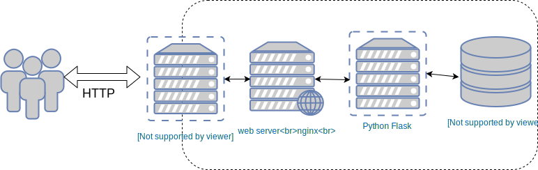

### Deploying applications


#### Deploying our application
* The `deploy.yml` playbook sets up the _Cat Pic of the Day_ application  <!-- .element: class="img-right" width="50%"-->
  * Web server running nginx
  * App server running a Python Flask
  * Postgresql Database
  * HA proxy


#### Reaching our servers
* Ansible needs to interact with our hosts via SSH
* However, we do not know how to reach our cluster
  - local inventory does not contain IP addresses
* Need to get info from OpenStack API


#### Dynamic inventories
* Programmatically extract info from cloud API using dynamic inventory
* Download and set up the openstack inventory script
```
mkdir -p ansible/inventory/dynamic
wget https://raw.githubusercontent.com/ansible/ansible/devel/contrib/inventory/openstack_inventory.py
chmod +x openstack_inventory.py
mv openstack_inventory.py ansible/inventory/dynamic/
```
<!-- .element: style="font-size:10pt;"  -->


#### Deploying our application
* The<!-- .element: class="fragment" data-fragment-index="0" --> `deploy.yml` playbook:
  - configures machines 
  - sets up database
  - deploys our web application
  - Configures the loadbalancer to direct HTTP between web1 and web2
* Should be able to access your new <!-- .element: class="fragment" data-fragment-index="1" --> <a href="http://my-app.cat">web application</a> 
* <!-- .element: class="fragment" data-fragment-index="2" -->View [loadbalancer admin page](http://my-app.cat/haproxy?stats)
  - login: admin
  - password is in `group_vars/loadbalancer/secrets.yml`


#### Summary

* Ansible has modules for provisioning at different cloud providers
  - As localhost
* Able to use SSH options for configuring via bastion host
* Easy to set up load balanced applications
