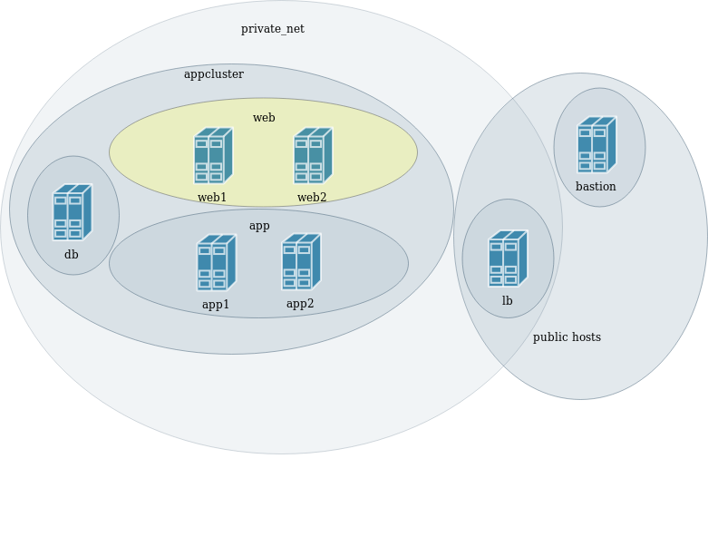

### Deploying applications


#### Deploying our application
* The `deploy.yml` playbook sets up the _Cat Pic of the Day_ application  <!-- .element: class="img-right" width="50%"-->
  * Web server running nginx
  * App server running a Python Flask
  * Postgresql Database
  * HA proxy


#### Overview of deploy playbook
* `ansible-playbook --list-tasks <playbook>` gives an overview of plays and
  tasks 
  ```
  ansible-playbook ansible/deploy.yml --list-tasks
  ```
  ```
  play #1 (private_net): Set ansible_host for private hosts     TAGS: []                                                                                  [0/19740]
    tasks:
    .
  play #2 (cluster): Update apt cache on all machines   TAGS: []
    tasks:
    .

  play #3 (db): Set up database machine TAGS: [deploy,db]
    tasks:
    .

  play #4 (db): Set up app and database machine TAGS: [deploy,db]
    tasks:
    .

  play #5 (app): Set up app server      TAGS: [deploy,app]
    tasks:
    .

  play #6 (web): Set up nginx on web server     TAGS: [deploy,web]
    tasks:
    .
  ```
  <!-- .element: style="font-size:8pt;"  -->


#### Role of Inventory and Groups
* _hosts_ attribute influences which hosts Ansible interacts with
  <pre><code data-trim data-noescape>
  hosts: <mark>web</mark>
  </code></pre>
* This will interact with all hosts in the _web_ group  <!-- .element: class="img-right" width="45%" -->


#### Role of Inventory and Groups
  <pre><code data-trim data-noescape>
  hosts: <mark>app</mark>
  </code></pre>
* This will interact with all hosts in the _app_ group  <!-- .element: class="img-right" width="45%" -->


#### Deploying the application
* Run the deploy playbook
  ```shell
  ansible-playbook ansible/deploy.yml
  ```
* Once deploy is finished you'll need the IP of your loadbalancer
  ```
  ansible-inventory --host pycon-lb | jq '{"publicIP": .openstack.public_v4}'
  ```
  <!-- .element: style="font-size:10pt;"  -->
* Should be able to open in your browser as:
  ```
  http://<public ip>.xip.io/
  ```


#### Viewing HAProxy stats
* HAProxy provides an overview of active web hosts in cluster
  ```
  http://<public ip>.xip.io/haproxy?stats
  ```
* Login details
  - user: admin
  - password: train
