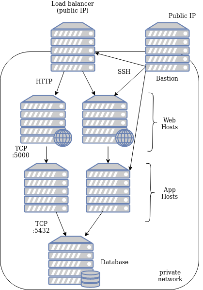
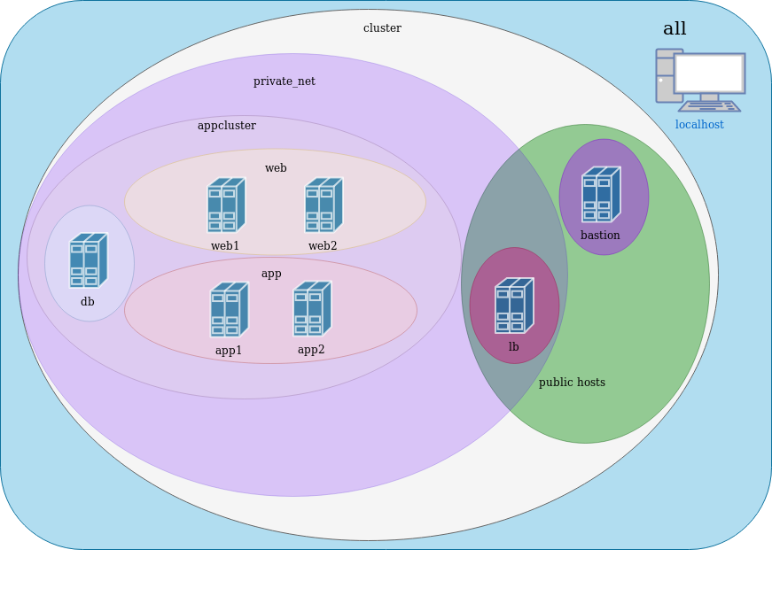
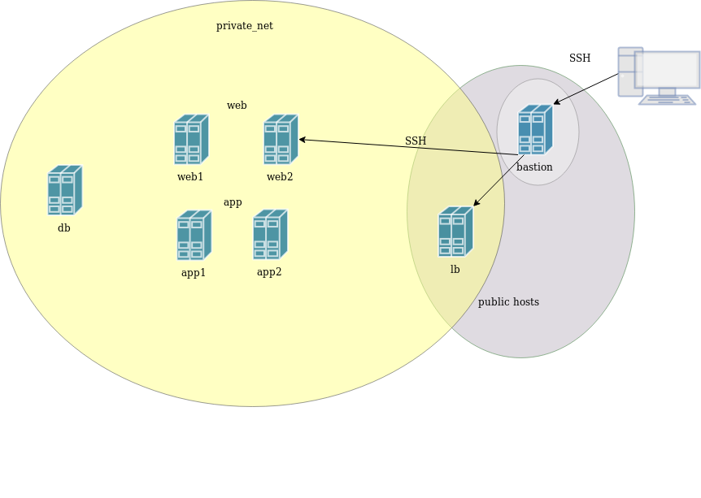

### Provisioning Hosts


#### Creating Our Cluster
* For this tutorial we are going to need seven machines
  - 2 for nginx web server
  - 2 for our web application
  - 1 database host
  - 1 load balancer
  - 1 bastion
* Seems like a lot, but we are trying to simulate upgrades across a cluster


#### Our cluster 
* <!-- .element: class="fragment" data-fragment-index="0" -->HTTP traffic reaches web hosts via load balancer
 <!-- .element: class="img-right"  width="30%"  -->
* <!-- .element: class="fragment" data-fragment-index="1" -->Application receives traffic from web hosts on port 5000
* <!-- .element: class="fragment" data-fragment-index="2" -->DB receives traffic from app hosts on 5432
* <!-- .element: class="fragment" data-fragment-index="3" -->SSH traffic
  - only bastion reachable from outside
  - all other hosts only from bastion


#### Host Inventory
* The inventory for our cluster is defined in 
  ```shell
  ansible/inventory/cloud-hosts
  ```
* Architecture defined using Ansible _groups_
  ```ini
  [loadbalancer]
  pycon-lb

  [web]
  pycon-web[1:2]# range of hosts i.e. pycon-web1, pycon-web2

  [app]
  pycon-app[1:2] 
  ```
  <!-- .element: style="font-size:9pt;"  -->
* Hosts may belong to multiple groups
  ```ini
  [web]
  pycon-web[1:2]

  [blue]
  pycon-web1
  ```
  <!-- .element: style="font-size:9pt;"  -->


#### High Level View <!-- .slide: class="image-slide" -->



#### The `provision-hosts.yml` playbook
* <!-- .element: class="fragment" data-fragment-index="0" -->Tasks in the
  first play are executed on local machine
   <pre style="font-size:10pt;"><code data-trim data-noescape>
   name:  Provision a set of hosts in Catalyst Cloud
   hosts: <mark>localhost</mark>
   gather_facts: false
   tasks:
</code></pre>
* <!-- .element: class="fragment" data-fragment-index="1" -->Behind the scenes using the `openstacksdk` API
* <!-- .element: class="fragment" data-fragment-index="2" -->Boilerplate for creating multiple cloud hosts
  - log in to cloud provider
  - create router, network, security groups
  - create each host

Note:
- all tasks with os in module are cloud api
- building cloud modules generally boilerplate


#### Cloud Modules
* Cloud deployments typically involve creating resources with a provider
  - Instances
  - Networks
  - Security groups, acls, etc
* We are using [OpenStack Modules](https://docs.ansible.com/ansible/latest/modules/list_of_cloud_modules.html#openstack)
  - All start with `os_`


#### Using OpenStack cloud modules
* The first play uses cloud modules to create objects on your tenant

```yaml
- name: Provision a set of hosts in the Catalyst Cloud
  hosts: localhost
  gather_facts: false
  tasks:
    - name: Connect to Catalyst Cloud
      os_auth:
      
    - name: Create keypair
      os_keypair:

    - name: Create network
      os_network:

    - name: Create cluster instances
      os_server:
```
<!-- .element: style="font-size:11pt;"  -->


#### Using Ansible via a bastion host
* Hosts in *private_net* group do not have public IP  <!-- .element: class="img-right" width="60%" -->
* Only bastion is directly accessible by SSH <!-- .element: class="fragment" data-fragment-index="0" -->
* All other hosts can only be reached from<!-- .element: class="fragment" data-fragment-index="2" --> _bastion_ 

Note: Adds some extra security for our cluster 


#### Traversing a bastion host
* <!-- .element: class="fragment" data-fragment-index="0" -->Ansible relies on SSH to talk to remote hosts
* <!-- .element: class="fragment" data-fragment-index="1" -->Just need to pass SSH arguments for hosts in *private_net* group
* <!-- .element: class="fragment" data-fragment-index="2" -->Assign to hostvars for each instance
* <!-- .element: class="fragment" data-fragment-index="3" -->Add following to `provision-hosts.yml`

```
# ADD SSH args
 - name: Set ssh args for bastion
   add_host:
     name: "{{ item.openstack.name  }}"
     ansible_ssh_common_args: "-o StrictHostKeyChecking=no -o ForwardAgent=yes"
   loop: "{{ launch.results }}"
   when: item.openstack.name in groups.bastion

 - name: Set ssh args for rest of cluster
   add_host:
     name: "{{ item.openstack.name  }}"
     ansible_ssh_common_args: "-o StrictHostKeyChecking=no -o ForwardAgent=yes -o ProxyCommand='ssh {{ hostvars[item.openstack.name].ansible_user }}@{{ hostvars[groups.bastion[0]].ansible_host }} exec nc -w300 %h %p'"
   loop: "{{ launch.results }}"
   when: item.openstack.name in groups.private_net
```
<!-- .element: style="font-size:8pt;"  class="fragment"
data-fragment-index="3" -->


#### Additional setup for hosts
* Set NZ locale, timezone, etc.
* Edit `/etc/hosts` on each host
  * bastion host to resolve all hosts in cluster
  * loadbalancer host to resolve all hosts in *web* group
  * _web_ to resolve _app_ host
  * _app_ host to resolve _db_
* Update local machine `/etc/hosts` to resolve our loadbalancer public IP


#### Setup the basics
* `/etc/host` mappings
* locales
* Add the following section to playbook

```yaml
# ADD host IP, locale
- name: Set up the bastion hosts
  hosts: bastion
  become: true
  tasks:
    - name: Add entry to /etc/hosts for all instances
      lineinfile:
        dest: /etc/hosts
        line: "{{ hostvars[item].ansible_host }} {{ item }}"
      with_items: "{{ groups.private_net }}"

- name: Common setup for all hosts
  hosts: cluster
  become: true
  tasks:
    - name: Add NZ locale to all instances
      locale_gen:
        name: en_NZ.UTF-8
        state: present

```
<!-- .element: style="font-size:8pt;"  -->


#### Delegation
* Often need to configure one host *in the context of another host*
* Run a command on server **A** using inventory from **B**
  * enable/disable web hosts at the load balancer
* The `delegate_to` directive is useful for this


#### Resolving application services and delegation
* Add the following plays to `provision-hosts.yml`

<pre style="font-size:8pt;"><code data-trim data-noescape>
# ADD resolving application components
- name: Set up web hosts with mapping to backend
  <mark>hosts: app</mark>
  become: true
  tasks:

    - name: Map each frontend host to speak to a specific backend
      lineinfile:
        dest: /etc/hosts
        line: "{{ ansible_host }} backend"
      <mark>delegate_to: "{{ prefix }}-web{{ group_index }}"</mark>
</code></pre>


#### Resolving application services and delegation
<pre style="font-size:8pt;"><code data-trim data-noescape>
- name: Add mapping for db on app boxes
  <mark>hosts: db</mark>
  become: true
  tasks:

    - name: Map each app host to speak to db
      lineinfile:
        dest: /etc/hosts
        line: "{{ ansible_host }} {{ inventory_hostname }}"
      <mark>delegate_to: "{{ item }}"</mark>
      with_items: "{{ groups.app }}"
</code></pre>


#### Provisioning Hosts
*  Start the provisioning playbook
   ```
   ansible-playbook -i ansible/inventory/cloud-hosts ansible/provision-hosts.yml
   ```
   <!-- .element: style="font-size:11pt;" class="stretch"  -->

* In case task fails with SSH error just hit `CTRL-C` and restart
<!-- .element: class="stretch"  -->
