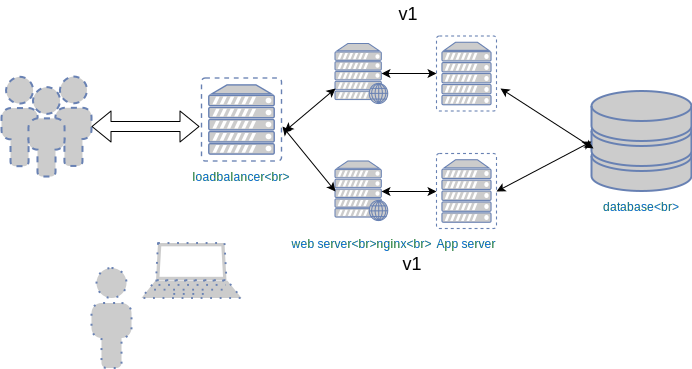
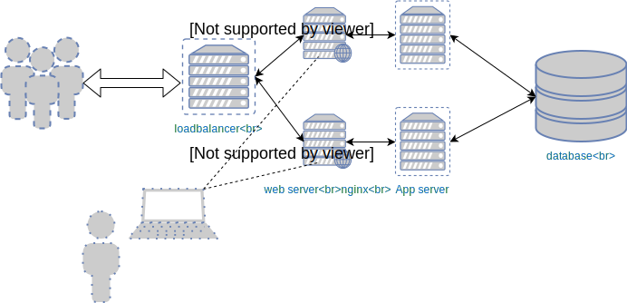

### _In place_ rolling upgrade
#### A Demo


#### Rolling upgrades

<pre><code data-trim data-noescape>

$ cd $INTERMED_ANSIBLE_DIR/deploying-code
.
├── failhosts.yml
├── group_vars
.
├── inventory
.
├── remove-hosts.yml
.
├── update-app-in-place.yml
└── update-nginx-in-place.yml
</code></pre>


#### Simple application


<!-- .element width="80%" height="80%" -->


#### Load balanced application

 <!-- .element width="50%" height="50%" -->

* Applications often installed on multiple machines/clusters
  - Ensures redundancy
  - High availability


#### Ansible default behaviour

* By default Ansible will act on multiple hosts at once <!-- .element: class="fragment" data-fragment-index="0" -->
* This can still lead to problems <!-- .element: class="fragment" data-fragment-index="1" -->

 <!--
.element: style="float:left;" width="45%" height="45%" class="fragment" data-fragment-index="0"-->
 <!--
.element: style="float:right;" width="45%" height="45%"  class="fragment" data-fragment-index="1" -->


#### Performing `serial` operations

* The<!-- .element: class="fragment" data-fragment-index="0" --> `serial` attribute regulates how many hosts Ansible operates on at a time 
* Serial can be represented as <!-- .element: class="fragment" data-fragment-index="1" -->
  * An integer <!-- .element: class="fragment" data-fragment-index="2" -->
   <pre  class="fragment" data-fragment-index="3" style="font-size:15pt;"><code data-trim data-noescape>
    - name: Upgrade application in place
      become: true
      hosts: app
      <mark>serial: 1</mark>
      vars:
    </code></pre>
  * A percentage of hosts in the cluster to act on <!-- .element: class="fragment" data-fragment-index="4" -->
    <pre  class="fragment" data-fragment-index="5" style="font-size:15pt;"><code data-trim data-noescape>
    - name: Upgrade application in place
      become: true
      hosts: app
      <mark>serial: "30%"</mark>
      vars:
    </code></pre>


#### Delegation
* As with provisioning, delegation is useful for updating hosts <!-- .element: class="fragment" data-fragment-index="0" -->
* The application that we need to update is on our web servers <!-- .element: class="fragment" data-fragment-index="1" -->
* However, as part of updating, we need to control haproxy on our loadbalancer
  <!-- .element: class="fragment" data-fragment-index="2" -->

<pre class="fragment" data-fragment-index="3"><code data-trim data-noescape>
- name: Upgrade application in place
  <mark>hosts: web</mark>
  serial: 1
  tasks:
    - name: Disable application at load balancer
      haproxy:
        .
        .
      <mark>delegate_to: "loadbalancer"</mark>
</code></pre>


#### Ensuring healthy upgrade

* After upgrading the application or config, typically want to <!-- .element: class="fragment" data-fragment-index="0" -->
  - Restart service that was upgraded <!-- .element: class="fragment" data-fragment-index="1" -->
  - Re-enable at loadbalancer <!-- .element: class="fragment" data-fragment-index="2" -->
* Before proceeding important to <!-- .element: class="fragment" data-fragment-index="3" -->
  - Reload or restart our service <!-- .element: class="fragment" data-fragment-index="4" -->
  - Make sure service is<!-- .element: class="fragment" data-fragment-index="5" --> _healthy_ 


#### Ensuring healthy upgrade

* <!-- .element: class="fragment" data-fragment-index="0" -->When we upgrade our application or config we trigger a restart using _notify_ 

  <pre  class="fragment" data-fragment-index="0"><code data-trim data-noescape>
  - name: Checkout application from git
    git:
      .
      .
    <mark>notify: restart gunicorn</mark>
  </code></pre>
* Normally this would trigger the handler at the end of a play <!-- .element: class="fragment" data-fragment-index="1" -->
  <pre  class="fragment" data-fragment-index="1"><code data-trim data-noescape>
  handlers:
    - name: restart gunicorn
      systemd:
        name: gunicorn
        state: restarted
  </code></pre>


#### Waiting for a service

* Instead of waiting for handler to execute at the end of play, we trigger it
  immediately<!-- .element: class="fragment" data-fragment-index="0" -->

  <pre  class="fragment" data-fragment-index="0"><code data-trim data-noescape>
  - name: Checkout application from git
    git:
      .
    notify: restart gunicorn
  <mark>- meta: flush_handlers</mark>
  </code></pre>
* We proceed when we are sure that the service is running <!-- .element: class="fragment" data-fragment-index="1" -->
  <pre  class="fragment" data-fragment-index="1"><code data-trim data-noescape>
    - name: Make sure app is listening on port 5000
      wait_for:
        port: 5000
  </code></pre>


#### Upgrade our application
```
ansible-playbook -i inventory/dynamic  update-app-in-place.yml -e app_version=v2
```
* Should run an in-place upgrade to _v2_ of our app
* Changes the background colour of the application
  - refresh the page frequently during upgrade
* While running, watch behaviour of [loadbalancer admin page](http://my-app.cat/haproxy?stats)


#### Summary

* The _in place rolling upgrade_ is a common approach to updating applications
  - Ensures zero downtime
  - Doesn't require expensive infrastructure
* Leveraging how Ansible works is critical
* Process segements of cluster in serial
* Delegation to operate across cluster more easily
* Fail fast to avoid leaving cluster in broken state
