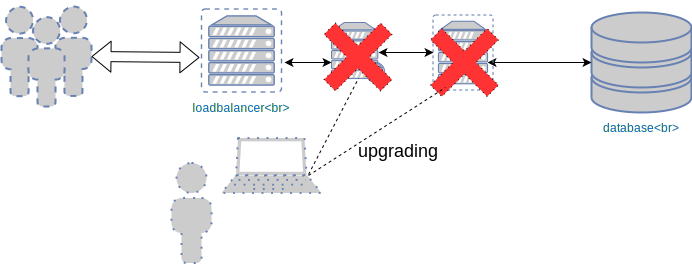
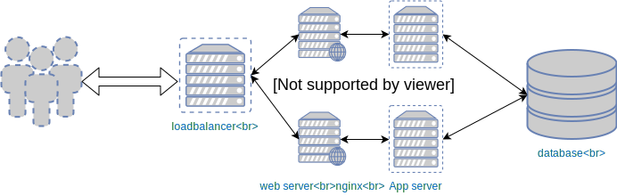
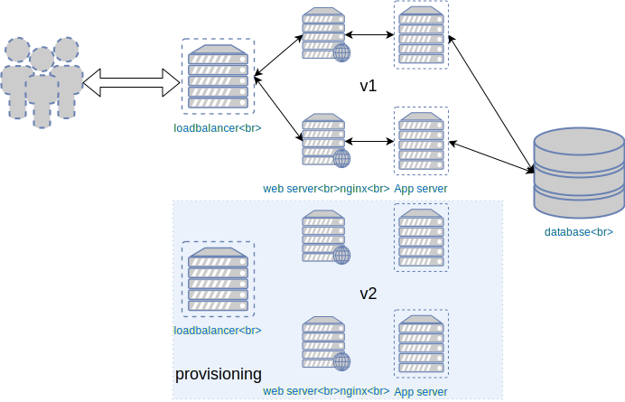
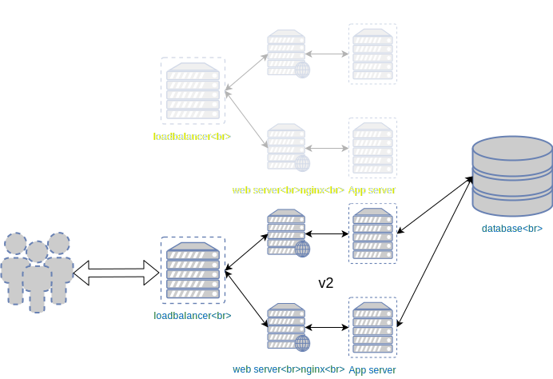
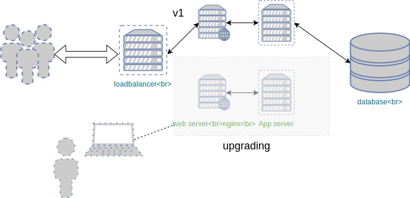
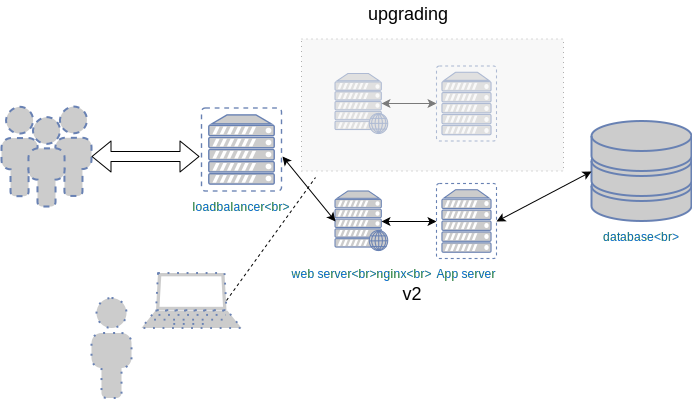

### Upgrade strategies

#### Upgrading our application
##### What can go wrong?
* Without some kind of redundancy, we risk of disrupting entire operation <!-- .element: class="fragment" data-fragment-index="0" -->
* Could be bad for business <!-- .element: class="fragment" data-fragment-index="1" -->

<!-- .element width="50%" height="50%"-->

#### Upgrade Strategies
* Blue-Green
* Expand and Contract
* Rolling Deployment

#### Blue-Green Deployments

<!-- .element: height="40%" width="40%" -->

* Two<!-- .element: class="fragment" data-fragment-index="0" --> identical production environments designated _blue_ and _green_ 
* Blue<!-- .element: class="fragment" data-fragment-index="1" --> environment is _live_ and handles all traffic 
* Green<!-- .element: class="fragment" data-fragment-index="2" --> environment is _idle_ 

#### Blue-Green Upgrade

<!-- .element: height="40%" width="40%" -->

* Final<!-- .element: class="fragment" data-fragment-index="0" --> stage of testing new production code takes place on the _green_ environment 
* When<!-- .element: class="fragment" data-fragment-index="1" --> checks and testing has completed, traffic is switched to _green_ 
  environment
* Updates<!-- .element: class="fragment" data-fragment-index="2" --> to production code installed on _blue_ environment 

#### Expand and contract

* This strategy involves deploying updates on completely new hosts
* Advantages
  - Machines are more up-to-date
  - No need to worry about config not managed by Ansible
  - Avoid configuration drift
  - Rolling back much easier

#### Upgrading by expanding contract

#### Expand phase

 <!-- .element height="50%" width="50%" -->

* Deploy application update to new machines <!-- .element: class="fragment" data-fragment-index="0" -->
* Current version remains active <!-- .element: class="fragment" data-fragment-index="1" -->

#### Change to new cluster

<!-- .element height="40%" width="40%" -->

* Once new cluster finished and healthy: <!-- .element: class="fragment" data-fragment-index="0" -->
  - Change DNS to point at new cluster
  - Stop services on old cluster
* Decommision old cluster <!-- .element: class="fragment" data-fragment-index="1" -->

#### In-place rolling upgrade

* Traditional approach to upgrading applications across a cluster <!-- .element: class="fragment" data-fragment-index="0" -->
  - Creating new infrastructure can be prohibitively expensive
* Operates on infrastructure that already exists <!-- .element: class="fragment" data-fragment-index="1" -->
* Minimise downtime by upgrading parts of the cluster at a time <!-- .element: class="fragment" data-fragment-index="2" -->

#### First step of in place upgrade

 <!-- .element
width="50%" height="50%"-->

* Disable application at LB (no HTTP requests) <!-- .element: class="fragment" data-fragment-index="0" -->
* Upgrade necessary applications, configuration <!-- .element: class="fragment" data-fragment-index="1" -->
* Re-enable at LB <!-- .element: class="fragment" data-fragment-index="2" -->

#### In place rolling upgrade
 <!-- .element width="50%" height="50%"-->

* Repeat process across pool <!-- .element: class="fragment" data-fragment-index="0" -->
* Mixed versions will be running for a period of time <!-- .element: class="fragment" data-fragment-index="1" -->

#### Summary
* Update infrastructure code should be designed to avoid *loss of service*
* Update strategies that ensure healthy system is always running are crucial
* Alternatives based on cost, hardware, ease of implementation
  - Blue-green
  - Expand and contract
  - Rolling Upgrade

