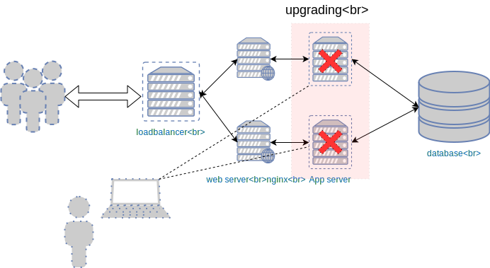
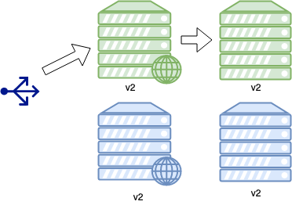
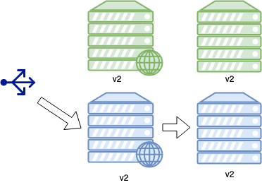
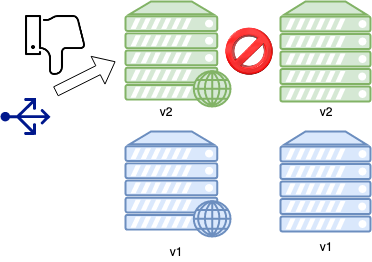

### Upgrade strategies


####  What can go wrong?
* Without some kind of redundancy, we risk of disrupting entire operation <!-- .element: class="fragment" data-fragment-index="0" -->

<div  class="fragment" data-fragment-index="0">


<!-- .element width="50%" height="50%"-->
</div>


#### Ideal upgrade scenario
* Minimal or zero downtime during upgrade of application
* Do not deploy a broken version of our application


#### Upgrade Strategies
* In-place rolling upgrade
* Blue-Green


#### In-place rolling upgrade

* Traditional approach to upgrading applications across a cluster <!-- .element: class="fragment" data-fragment-index="0" -->
  - Creating new infrastructure can be prohibitively expensive
* Operates on infrastructure that already exists <!-- .element: class="fragment" data-fragment-index="1" -->
* Minimise downtime by upgrading parts of the cluster at a time <!-- .element: class="fragment" data-fragment-index="2" -->


#### Upgrading applications
* Rolling upgrade play similar to running just _app_ plays in `deploy.yml`
  ```shell
  ansible-playbook  ansible/app-rolling-upgrade.yml -e app_version=v2
  ```
  <!-- .element: style="font-size:10pt;"  -->
  ```
  ansible-playbook ansible/deploy.yml -e app_version=v2 --limit app
  ```
  <!-- .element: style="font-size:10pt;"  -->
* Tempting to rely on Ansible's idempotent behaviour
* There are two problems with this approach
  - Ansible's default _batch management_ behaviour
  - `deploy.yml` does not check _health_ of application


#### Ansible _batch management_ problem
* By default runs each task on all hosts concurrently
* <!-- .element: class="fragment" data-fragment-index="4" -->A failed task might leave cluster in a broken state

|Tasks | Host1 | Host2 |
|---   | ---   | ---   |
|task1 |  <code style="color:green;" class="fragment" data-fragment-index="0">ok</code>     |   <code style="color:green;" class="fragment" data-fragment-index="0">ok</code>    | 
|task2 |  <code style="color:green;" class="fragment" data-fragment-index="1">ok</code>     |    <code style="color:green;" class="fragment" data-fragment-index="1">ok</code>   |
|task3 |   <code style="color:red;" class="fragment" data-fragment-index="2">fail</code>    |   <code style="color:red;" class="fragment" data-fragment-index="2">fail</code>    | 
|task4  |    <code class="fragment" data-fragment-index="3">-</code>   |   <code class="fragment" data-fragment-index="3">-</code>    |  


#### Deploying broken code
* Broken code may not be obvious in task
* <!-- .element: class="fragment" data-fragment-index="2" -->One task (<code style="color:red;">\*</code>) leaves application in a broken state

|Tasks | Host1 | Host2 |
|---   | ---   | ---   |
|task1 |  <code style="color:green;" class="fragment" data-fragment-index="0">ok</code>     |   <code style="color:green;" class="fragment" data-fragment-index="0">ok</code>    |
|task2 |  <code style="color:green;" class="fragment" data-fragment-index="1">ok</code>     |    <code style="color:green;" class="fragment" data-fragment-index="1">ok</code>   |
|task3<code style="color:red;" class="fragment" data-fragment-index="2">\*</code>  |   <code style="color:green;" class="fragment" data-fragment-index="2">ok</code>    |   <code style="color:green;" class="fragment" data-fragment-index="2">ok</code>    | 
|task4 |   <code style="color:green;" class="fragment" data-fragment-index="3">ok</code>    |   <code style="color:green;" class="fragment" data-fragment-index="3">ok</code>    | 

<!-- .element: style="float:left" width:50%  -->

 <!-- .element: class="fragment" width="50%" data-fragment-index="4"  -->


#### Fixing the batch problem
* The `serial` attribute can be added to the _play_ attributes
* Determines batch size Ansible will operate in parallel
  - integer
    * <code>serial: 1</code>
    * <code>serial: 3</code>
  - percentage of cluster
    * <code>serial: 50%</code>


#### Controlled batch size
* Running with `serial` attribute set to 1

|Tasks | Host1 | Host2 |
|---   | ---   | ---   |
|task1 |  <code style="color:green;" class="fragment" data-fragment-index="0">ok</code>     |   <code style="color:green;" class="fragment" data-fragment-index="4">ok</code>    |
|task2 |  <code style="color:green;" class="fragment" data-fragment-index="1">ok</code>     |    <code style="color:green;" class="fragment" data-fragment-index="5">ok</code>   | 
|task3  |   <code style="color:green;" class="fragment" data-fragment-index="2">ok</code>    |   <code style="color:green;" class="fragment" data-fragment-index="6">ok</code>    | 
|task4 |   <code style="color:green;" class="fragment" data-fragment-index="3">ok</code>    |   <code style="color:green;" class="fragment" data-fragment-index="7">ok</code>    | 


#### Using `serial` in our upgrade
* Update `app-rolling-upgrade.yml` as follows:
  <pre style="font-size:10pt;"><code data-trim data-noescape class="yaml">
  - name: Upgrade application in place
    become: true
    hosts: app
    # Serial attribute
    <mark>serial: 1</mark>
  </code></pre>
* Run the `app-rolling-upgrade.yml` playbook again with `-e app_version=v2`
* <!-- .element: class="fragment" data-fragment-index="0" -->Try again with `-e app_version=v3`


#### Deploying broken code
* Deploying `app_version=v3` still breaks the application

|Tasks | Host1 | Host2 |
|---   | ---   | ---   |
|task1 |  <code style="color:green;" class="fragment" data-fragment-index="0">ok</code>     |   <code style="color:green;" class="fragment" data-fragment-index="4">ok</code>    | 
|task2 |  <code style="color:green;" class="fragment" data-fragment-index="1">ok</code>     |    <code style="color:green;" class="fragment" data-fragment-index="5">ok</code>   |
|task3<code style="color:red;" class="fragment" data-fragment-index="2">\*</code>  |   <code style="color:green;" class="fragment" data-fragment-index="2">ok</code>    |   <code style="color:green;" class="fragment" data-fragment-index="6">ok</code>    | 
|task4 |   <code style="color:green;" class="fragment" data-fragment-index="3">ok</code>    |   <code style="color:green;" class="fragment" data-fragment-index="7">ok</code>    | 


#### Detecting Failure
* Need to detect broken application and stop deployment
* Verify app is running after upgrade
  - process id
  - listening on port
* The Flask web application that runs on app server listens on port 5000
* Can use `wait_for` to stop and listen for port to be open before proceeding


#### Listen on port
* Add following to `app-rolling-upgrade.yml`
  ```
  # ADD wait for 5000
  - name: Make sure gunicorn is accepting connections
    wait_for:
      port: 5000
      timeout: 60
  ```
* We're still missing something so don't run the playbook yet!


#### Kicking the handlers
* The application may not have loaded new configuration
* We need to cause handler to restart gunicorn before waiting on port
* Add following to `app-rolling-upgrade.yml`
  ```
  # ADD flush handlers
  - meta: flush_handlers
  ```
* Now re-run the playbook with `-e app_version=v3`


#### Failing fast
* Playbook stops execution on first host when check on port fails

|Tasks | Host1 | Host2 |
|---   | ---   | ---   |
|task1 |  <code style="color:green;" class="fragment" data-fragment-index="0">ok</code>     |   <code class="fragment" data-fragment-index="4">-</code>    | 
|task2 |  <code style="color:green;" class="fragment" data-fragment-index="1">ok</code>     |    <code class="fragment" data-fragment-index="4">-</code>   |
|restart gunicorn<code style="color:red;" class="fragment" data-fragment-index="2">\*</code>  |   <code style="color:green;" class="fragment" data-fragment-index="2">ok</code>    |   <code class="fragment" data-fragment-index="4">-</code>    | 
|wait_for |   <code style="color:red;" class="fragment" data-fragment-index="3">fail</code>    |   <code style="color:green;" class="fragment" data-fragment-index="4">-</code>    | 


#### Load balancing and upgrades
* During an upgrade we change configuration and restart the application
* Downtime might be disruptive to users of website
* Following update with `app_version=v3` half of the application is also
  broken
  ```
  curl -iv http://<public ip>.xip.io
  ```
  ```
  < HTTP/1.1 502 Bad Gateway
  HTTP/1.1 502 Bad Gateway
  .
  ```


#### Avoiding disruptions 
* Ideally the loadbalancer should not send traffic to the hosts(s) we are
  updating
* While upgrading _app_ host, need to disable traffic to upstream web host


#### Host Context
* <!-- .element: class="fragment" data-fragment-index="0" -->The `hosts:` attribute of a play determines *context*
  <pre><code data-trim data-noescape> 
  - name: Play on app host
    <mark>hosts: app</mark>
  </code></pre>
* <!-- .element: class="fragment" data-fragment-index="1" -->While on host `app1`, I can call all inventory variables by name, i.e.
  - `ansible_host`
* <!-- .element: class="fragment" data-fragment-index="2" -->If I want variable for a different host, must use _hostvars_
  - hostvars['otherhost'].ansible_host


#### Delegation
* <!-- .element: class="fragment" data-fragment-index="0" -->Sometimes need to configure one host *in the context of another host*
* <!-- .element: class="fragment" data-fragment-index="1" -->Run a command on server **B** using inventory from **A**
  * enable/disable web hosts at the load balancer
* <!-- .element: class="fragment" data-fragment-index="2" -->The `delegate_to` directive is useful for this


#### Using delegation
* We want to disable host we're updating on pycon-lb
  <pre class="fragment" data-fragment-index="0"><code data-trim data-noescape>
    # ADD disable application at lb
    - name: Disable application at load balancer
      haproxy:
        backend: catapp-backend
        host: "{{ web_server }}"
        state: disabled
      <mark>delegate_to: "{{ item }}"</mark>
      <mark>loop: "{{ groups.loadbalancer }}"</mark>
  </code></pre>


#### Enabling host at loadbalancer
* When we are sure the app is running, we need to re-enable traffic to the
  host
  <pre class="fragment" data-fragment-index="0"><code data-trim data-noescape>
    # ADD enable application at lb
    - name: Re-enable application at load balancer
      haproxy:
        backend: catapp-backend
        host: "{{ web_server }}"
        state: enabled
      <mark>delegate_to: "{{ item }}"</mark>
      <mark>loop: "{{ groups.loadbalancer }}"</mark>
  </code></pre>


#### In Place Rolling Upgrade
* Run playbook with `app_version=`
  - v1
  - v2
  - v3
* During upgrades 
  - curl site url from terminal
  - check HAProxy stats
* Upgrade  to v3 should not leave entire cluster (or part of site) broken


#### First step of in place upgrade

 <!-- .element
width="50%" height="50%"-->

* Disable application at LB (no HTTP requests) <!-- .element: class="fragment" data-fragment-index="0" -->
* Upgrade necessary applications, configuration <!-- .element: class="fragment" data-fragment-index="1" -->
* Re-enable at LB <!-- .element: class="fragment" data-fragment-index="2" -->


#### In place rolling upgrade
 <!-- .element width="50%" height="50%"-->

* Repeat process across pool <!-- .element: class="fragment" data-fragment-index="0" -->
* Mixed versions will be running for a period of time <!-- .element: class="fragment" data-fragment-index="1" -->


#### Blue Green Deployments


Start with all traffic going to _blue_ hosts


#### Begin update


Update traffic on _green_ hosts


#### Check green is ok


Direct traffic through green and verify ok


#### Update blue side of cluster


Ok, so update _blue_ side


#### Reset traffic to blue


Reset traffic to _blue_ side of cluster


#### Dealing with failure


Alternative if green app not healthy


#### Return to original state


Redirect traffic back to _blue_


#### Setting up Blue-Green
* We need to do is put our cluster in _blue-green_ mode
* <!-- .element: class="fragment" data-fragment-index="0" -->First reset our environment
  ```
   ansible-playbook ansible/app-rolling-upgrade.yml -e app_version=v1
  ```
* <!-- .element: class="fragment" data-fragment-index="1" -->Run the following playbook:
  ```
  ansible-playbook ansible/setup-blue-green.yml -e live=blue
  ```
* <!-- .element: class="fragment" data-fragment-index="2" -->Verify half of cluster active on HAProxy stats page


#### Blue green update playbook
* For blue green we will use the following playbook
```
ansible/app-blue-green-upgrade.yml
```


#### Ad hoc groups
* For _blue-green_ we need to assign _active_ and _not active_ half of cluster
* Can assign groups of host to ad hoc groups when running Ansible
* By default we declare _blue_ active
   <pre style="font-size:10pt;" class="fragment" data-fragment-index="0" ><code data-trim data-noescape>
   # ADD set active group
  - name: Set live group as active
    hosts: localhost
    gather_facts: false
    vars:
      active: "{{ groups[ live | default('blue') ] }}"
    tasks:
      - name: Add active hosts to group
        <mark>add_host:</mark>
        <mark>  name: "{{ item }}"</mark>
        <mark>  groups:</mark>
        <mark>    - active</mark>
        with_items: "{{ active | default(groups.blue_green) }}"
</code></pre>
* <!-- .element: class="fragment" data-fragment-index="1" -->Can override with `-e live=green`


#### Summary
* Update infrastructure code should be designed to avoid *loss of service*
* Update strategies that ensure healthy system is always running are crucial
* Alternatives based on cost, hardware, ease of implementation
  - Blue-green
  - Rolling Upgrade

