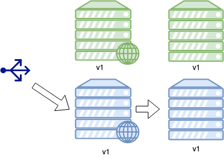

### Upgrade strategies

####  What can go wrong?
* Without some kind of redundancy, we risk of disrupting entire operation <!-- .element: class="fragment" data-fragment-index="0" -->
* Could be bad for business <!-- .element: class="fragment" data-fragment-index="1" -->

<!-- .element width="50%" height="50%"-->

#### Upgrade Strategies
* In-place rolling upgrade
* Blue-Green

#### In-place rolling upgrade

* Traditional approach to upgrading applications across a cluster <!-- .element: class="fragment" data-fragment-index="0" -->
  - Creating new infrastructure can be prohibitively expensive
* Operates on infrastructure that already exists <!-- .element: class="fragment" data-fragment-index="1" -->
* Minimise downtime by upgrading parts of the cluster at a time <!-- .element: class="fragment" data-fragment-index="2" -->

#### First step of in place upgrade

 <!-- .element
width="50%" height="50%"-->

* Disable application at LB (no HTTP requests) <!-- .element: class="fragment" data-fragment-index="0" -->
* Upgrade necessary applications, configuration <!-- .element: class="fragment" data-fragment-index="1" -->
* Re-enable at LB <!-- .element: class="fragment" data-fragment-index="2" -->

#### In place rolling upgrade
 <!-- .element width="50%" height="50%"-->

* Repeat process across pool <!-- .element: class="fragment" data-fragment-index="0" -->
* Mixed versions will be running for a period of time <!-- .element: class="fragment" data-fragment-index="1" -->

#### Blue Green Deployments

* Start deployment with traffic going through *blue* hosts

#### Summary
* Update infrastructure code should be designed to avoid *loss of service*
* Update strategies that ensure healthy system is always running are crucial
* Alternatives based on cost, hardware, ease of implementation
  - Blue-green
  - Expand and contract
  - Rolling Upgrade

